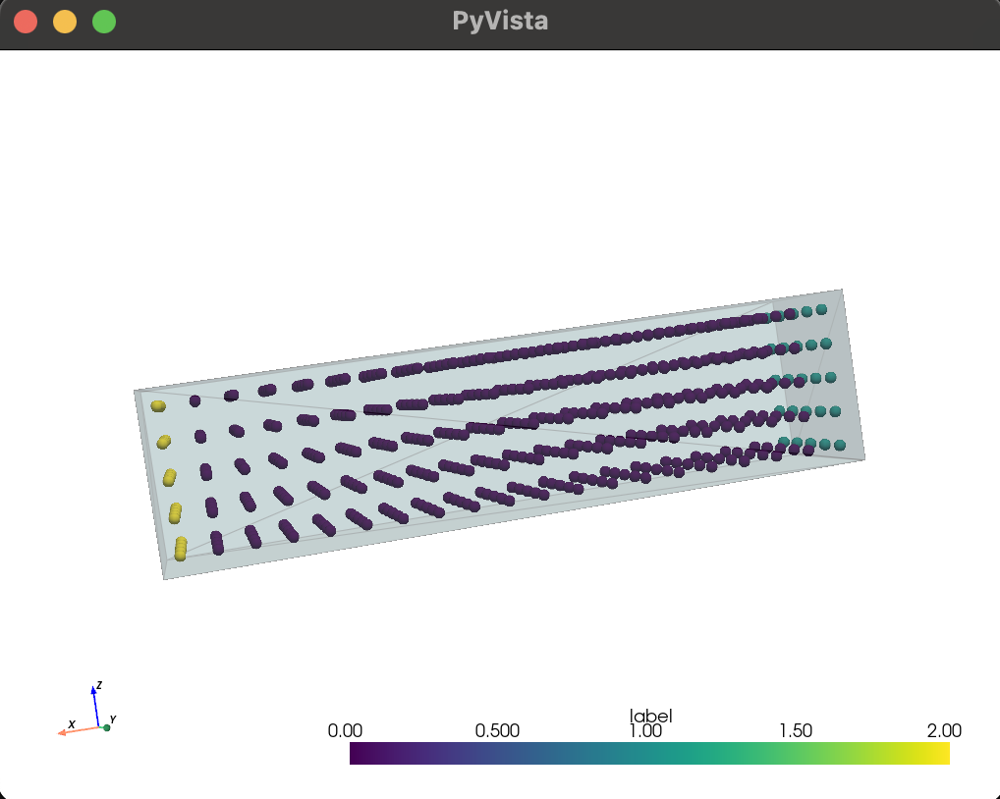

# STL Particle Preprocessor

## Overview

This project is a Python-based preprocessing pipeline that converts simple watertight STL geometry into a volumetric particle cloud for meshfree simulation workflows.

The goal of this project is to simulate the type of preprocessing required in particle-based computational mechanics methods (e.g., SPH), where continuous geometry must be discretized into particles before simulation.



## Features

* Loads STL geometry using Trimesh
* Generates a regular 3D grid of candidate particle locations
* Filters points to retain only those inside the geometry
* Tags boundary-condition regions (e.g., fixed and loaded surfaces)
* Exports particle data to:

  * CSV (for inspection)
  * VTP (for scientific visualization)
* Visualizes geometry and particle distribution using PyVista

## Pipeline

The preprocessing workflow follows these steps:

1. **Geometry Input**
   Load a watertight STL file representing the simulation domain.

2. **Bounding Box Sampling**
   Generate a uniform 3D grid of candidate points over the geometry’s bounding box.

3. **Interior Filtering**
   Use point-in-mesh queries to retain only points inside the geometry.

4. **Boundary Tagging**
   Assign labels to particles based on spatial location:

   * Fixed boundary (e.g., left face)
   * Load boundary (e.g., right face)
   * Interior points

5. **Export & Visualization**
   Save particle data and visualize the resulting discretization.

## Technologies Used

* **Python**
* **NumPy** – numerical computation and grid generation
* **Trimesh** – mesh loading and geometric queries
* **PyVista** – visualization and VTK export

## Example Output

* `outputs/beam_particles.csv` → particle coordinates and labels
* `outputs/beam_particles.vtp` → visualization-ready point cloud

The visualization shows:

* the original geometry (transparent mesh)
* interior particle distribution
* boundary-tagged regions (color-coded)

## Assumptions

* Input geometry must be **watertight**
* Particle spacing is **uniform**
* Boundary conditions are assigned using **simple geometric rules**

## Limitations

* Does not handle non-watertight meshes robustly
* Uses uniform discretization (no adaptive refinement)
* Boundary tagging is heuristic and geometry-specific
* Designed for simple geometries (e.g., beams, blocks)

## How to Run

1. Install dependencies:

```bash
pip install trimesh pyvista numpy matplotlib rtree
```

2. Place an STL file in the `data/` folder (e.g., `beam.stl`)

3. Run:

```bash
python generate_grid.py
```

4. View results in:

* `outputs/` folder
* interactive PyVista window

## Motivation

This project was built to explore how geometric preprocessing pipelines convert CAD/mesh-based representations into particle-based discretizations for simulation. It serves as a lightweight prototype of preprocessing infrastructure used in computational mechanics research.

